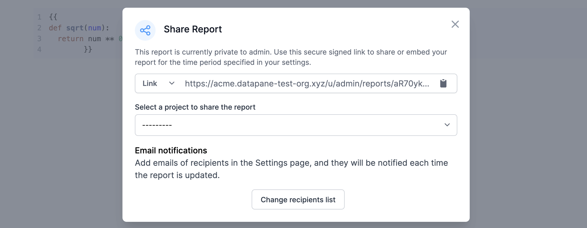

# Authentication and Sharing

Datapane allows secure, authenticated sharing of reports, scripts, blobs, and secrets. Each user on your Datapane instance (e.g. [https://acme.datapane.net](https://acme.datapane.net)) has a private password-protected account.

For more information on getting started, please see our tutorial sections on [Datapane CLI installation](/tutorials/basics/install-datapane/) and [authenticating with your Datapane server](/tutorials/datapane-cloud/authenticate-datapane/#datapane-teams).

!!! info
    
    Each Datapane instance exists as a separate database tenancy, so accounts are not shared between instances. You cannot use the same account to authenticate across multiple instances (including Datapane Community).

## Access Tokens

If you want to share a private report with an outside party - such as a client or contractor - you can use the link provided next to the **Share** button to generate a secure signed token. This link contains this token which allows anyone with the link to access the report, without signing up to Datapane.

This token also works across embeds, so you can [embed](/tutorials/datapane-cloud/embedding/#business-integrations) a private report into platforms such as Confluence or your own webpage. You can also use the [report notifications](/tutorials/datapane-cloud/report-notifications "mention") mechanism for this.&#x20;

!!! info

    For security reasons, access tokens are revoked after 48 hours, but this can be configured by your instance admin under Settings -> Account -> Secure signed link timeout.&#x20;

## Projects

To share a report with a specific group of people on your Datapane Server, your administrator can create a Project under Settings -> Projects. When a new user is added to your Datapane server, the administrator can add them to a specific project. This is especially useful for sharing with external clients.&#x20;

!!! warning
    
    Datapane Servers come with a default project. All reports and scripts are shared with the `default` group automatically. If you do not want specific internal or external users to view these reports, **do not add them to the `default` project**.

You can also change the project of a report via the web UI (as per the first image above).
